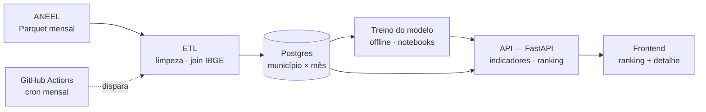

# Arquitetura

Quatro camadas — dados, ML, backend e frontend — conectadas por um único fluxo, atualizado mensalmente.

## Camadas

**ETL (`etl/`)** — baixa os arquivos Parquet publicados anualmente pela ANEEL, limpa e valida os registros, calcula a duração de cada interrupção (a partir de `DatInicioInterrupcao`/`DatFimInterrupcao`, que não vêm prontos), cruza o conjunto de unidades consumidoras de cada evento (`IdeConjuntoUnidadeConsumidora`) com o dataset "IndQual Município" para obter UF/nome do município — distribuindo (fan-out) o evento entre todos os municípios do conjunto quando ele atende mais de um —, e agrega tudo em um dataset município × mês. A ingestão é idempotente: pode ser executada de novo com segurança quando a ANEEL publica uma atualização mensal.

**ML (`ml/`)** — exploração dos dados e treino do modelo de previsão de risco (volume esperado de interrupções por município no mês seguinte). Comparação obrigatória contra um baseline ingênuo (persistência sazonal), validação por corte temporal (nunca embaralhar meses entre treino e teste), e interpretabilidade (importância de features / SHAP) ligada diretamente às recomendações de mitigação.

**API (`api/`)** — FastAPI servindo os indicadores históricos, o ranking de risco previsto e a explicação por trás de cada previsão, lendo do Postgres e do artefato do modelo treinado.

**Web (`web/`)** — frontend mínimo consumindo a API: ranking de municípios por risco e uma tela de detalhe com histórico real vs. previsto e causas dominantes.

**Automação (`.github/workflows/atualizacao-mensal.yml`)** — workflow agendado mensalmente (dia 5, com `workflow_dispatch` para disparo manual) que roda `make atualizar-mensal`: baixa o Parquet atualizado da ANEEL, reprocessa o ETL, roda os testes, recarrega o Postgres, retreina o modelo e regenera os artefatos derivados (importância de features, mapa de clusters). Sem servidor pago para "reimplantar" durante a avaliação do desafio, republicar significa: (1) subir a API de verdade contra os artefatos novos e rodar um smoke test (`/health`, `/ranking`, `/priorizacao`, `/mapa`) antes de publicar qualquer coisa; (2) publicar os artefatos grandes/gitignorados (dado processado + modelo treinado) como assets de uma GitHub Release mensal; (3) commitar de volta em `main` só os artefatos pequenos já versionados (importância de features, KML do mapa, metadata do modelo) — um `git pull` a qualquer momento reflete o mês mais recente já processado. Todo o pipeline é idempotente (`etl/download.py` só rebaixa o que mudou; `etl/pipeline.py`/`etl/load_db.py` sempre reescrevem do zero), então rodar o workflow duas vezes no mesmo mês, ou num mês sem publicação nova da ANEEL, é seguro.

## Decisões de engenharia

- **Município resolvido via bridge conjunto→município**, não via código IBGE direto: o dataset de interrupções só publica o conjunto de unidades consumidoras (`IdeConjuntoUnidadeConsumidora`) — o de-para para município vem do dataset separado "IndQual Município" (ver `etl/ibge.py`).
- **Fan-out para conjuntos compartilhados entre municípios, em dois níveis de agregação**: 40,5% dos conjuntos reais atendem mais de um município. Cada conjunto é distribuído entre todos os municípios que atende, com peso `1/n_municipios_no_conjunto`, para não escolher arbitrariamente um "município principal" nem inflar o total nacional de eventos -- mas esse fan-out acontece só depois de agregar os ~19 milhões de eventos brutos para o grão conjunto × mês (poucas centenas de milhares de linhas): fazer o fan-out direto no nível evento estourou a memória de uma máquina comum ao rodar contra o dataset real (ver `docs/DEVLOG.md`).
- **Interrupções programadas** (`DscTipoInterrupcao`): mantidas com uma flag em vez de descartadas, para não distorcer silenciosamente os indicadores — substitui o conceito de "expurgado" da documentação oficial, que não tem campo equivalente no schema real.
- **Grão município-mês**: reduz um dataset de milhões de eventos brutos para dezenas de milhares de linhas agregadas — permite usar todo o histórico disponível (2024 em diante, ver `Makefile`/`docs/DEVLOG.md`) sem custo computacional relevante.
- **Validação temporal**: treino até o mês T, teste em T+1 em diante.
- **Recorrência sem infraestrutura paga**: pipeline idempotente + workflow mensal demonstrável via disparo manual (`workflow_dispatch`).

Esta arquitetura evolui conforme o projeto avança — mudanças relevantes são registradas em [`DEVLOG.md`](DEVLOG.md).
