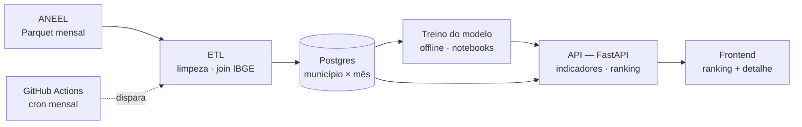

# Arquitetura

Quatro camadas — dados, ML, backend e frontend — conectadas por um único fluxo, atualizado mensalmente.

## Camadas

**ETL (`etl/`)** — baixa os arquivos Parquet publicados anualmente pela ANEEL, limpa e valida os registros, calcula a duração de cada interrupção (a partir de `DatInicioInterrupcao`/`DatFimInterrupcao`, que não vêm prontos), cruza `CodMunicipioIBGE` com uma tabela pública do IBGE para obter UF/nome do município, e agrega tudo em um dataset município × mês. A ingestão é idempotente: pode ser executada de novo com segurança quando a ANEEL publica uma atualização mensal.

**ML (`ml/`)** — exploração dos dados e treino do modelo de previsão de risco (volume esperado de interrupções por município no mês seguinte). Comparação obrigatória contra um baseline ingênuo (persistência sazonal), validação por corte temporal (nunca embaralhar meses entre treino e teste), e interpretabilidade (importância de features / SHAP) ligada diretamente às recomendações de mitigação.

**API (`api/`)** — FastAPI servindo os indicadores históricos, o ranking de risco previsto e a explicação por trás de cada previsão, lendo do Postgres e do artefato do modelo treinado.

**Web (`web/`)** — frontend mínimo consumindo a API: ranking de municípios por risco e uma tela de detalhe com histórico real vs. previsto e causas dominantes.

**Automação (`.github/workflows/`)** — workflow agendado mensalmente que reexecuta o ETL contra os dados atualizados da ANEEL e republica o ranking, sem depender de infraestrutura paga rodando continuamente durante a avaliação do desafio.

## Decisões de engenharia

- **Registros expurgados** (`DscMotivoExpurgo`): mantidos com uma flag em vez de descartados, para não distorcer silenciosamente os indicadores.
- **Grão município-mês**: reduz um dataset de centenas de milhares de eventos brutos para dezenas de milhares de linhas agregadas — permite usar o histórico completo (2017–2026) sem custo computacional relevante.
- **Validação temporal**: treino até o mês T, teste em T+1 em diante.
- **Recorrência sem infraestrutura paga**: pipeline idempotente + workflow mensal demonstrável via disparo manual (`workflow_dispatch`).

Esta arquitetura evolui conforme o projeto avança — mudanças relevantes são registradas em [`DEVLOG.md`](DEVLOG.md).
